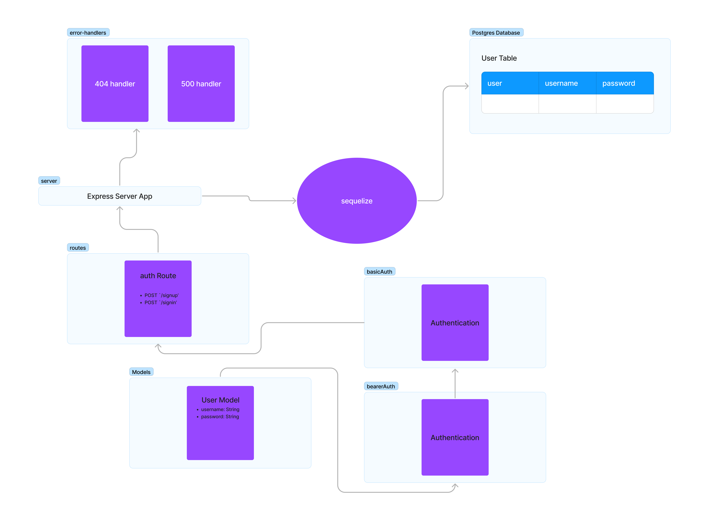

# LAB - Class 07

## Project: Bearer Authentication

### Author: Bryan O. Garduno Gonzalez

### Problem Domain  

This project aims to implement a Bearer Authentication system using Express and Sequelize ORM. Users can sign up, sign in, access a list of all users, and get a welcome message to a secret area upon successful authentication. The system supports both Basic and Bearer authentication mechanisms.

### Links and Resources

- [GitHub Actions ci/cd]()
- Dev [back-end server dev branch url]()
- Main [back-end server main branch url]()

### Collaborators

[List any collaborators here, if any]

### Setup

#### `.env` requirements (where applicable)

A .env file is included in the local repository. A .env-sample file is uploaded to the remote repo so collaborators understand what environmental variables are being used.

#### How to initialize/run your application (where applicable)

- Run `npm start` to initialize the application.

#### Features / Routes

- **Server Modularization:**
  - Entry point in `index.js` initializes the server upon a successful database connection.
  - Server logic is found in `server.js`.

- **Middleware Implementation:**
  - **404 Not Found (`404.js`):** Manages unrecognized routes with a 404 status.
  - **500 Server Error (`500.js`):** Handles server errors with a 500 status and error details.
  - **Basic Authentication (`basic.js`):** Middleware for basic auth (username and password).
  - **Bearer Authentication (`bearer.js`):** Middleware for bearer auth (using tokens).

- **User Authentication Routes (in `router/index.js`):**
  - **Signup Route (`handlers.js`):**
    - `POST /signup`: Signs up a new user.
  - **Signin Route (`handlers.js`):**
    - `POST /signin`: Authenticates and logs in a user using basic auth.
  - **Get Users Route (`handlers.js`):**
    - `GET /users`: Returns a list of usernames. Requires bearer authentication.
  - **Secret Area Route (`handlers.js`):**
    - `GET /secret`: Welcomes authenticated users to a secret area. Requires bearer authentication.

### Tests

- **How do you run tests?**
  - Navigate to the root directory and execute `npm test`.

- **Any tests of note?**
  
  **1. Error Handlers Testing**
    - Ensure the system responds with a `404` for non-existent routes.
    - Ensure the system responds with a `500` for server errors.
  
  **2. Basic Authentication Middleware Testing**
    - Verify failure for login when a user provides incorrect basic credentials.
    - Validate successful login for an admin user with the correct credentials.

  **3. Bearer Authentication Middleware Testing**
    - Ensure failure for a user login when providing an incorrect token.
    - Authenticate a user with the proper token.
  
  **4. Auth Router Testing**
    - Ensure new users can be created.
    - Authenticate sign-in with basic auth string.
    - Authenticate sign-in with bearer auth token.
    - Validate failure scenarios for both basic and bearer authentications.
    - Access routes with valid and invalid tokens.
  
  **5. Route Handlers Testing**
  
    **a. Secret Route Handler**
      - Verify that a user with correct authorization receives a secret response.
    
    **b. Get Users Route Handler**
      - Fetch users and validate the response.
    
    **c. Signin Route Handler**
      - Check for user presence and validate the response.
      - Trigger the error handler when no user is present on the request.
    
    **d. Signup Route Handler**
      - Respond with a new user if a username and password are provided.
      - Trigger the error handler in case of missing credentials.

- **Describe any tests that you did not complete, skipped, etc.**
  - All intended tests for this phase have been executed. New features in upcoming phases might demand additional tests for comprehensive coverage.

#### UML
;
